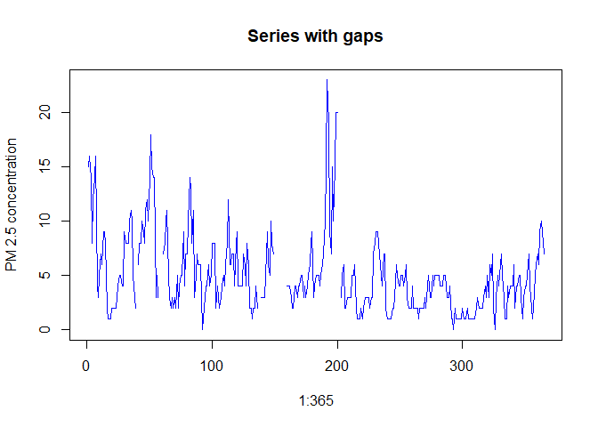
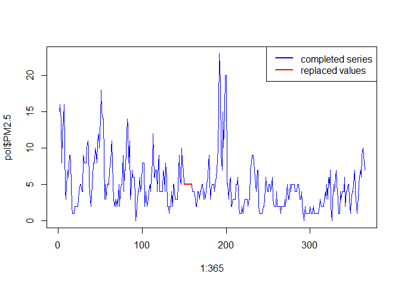
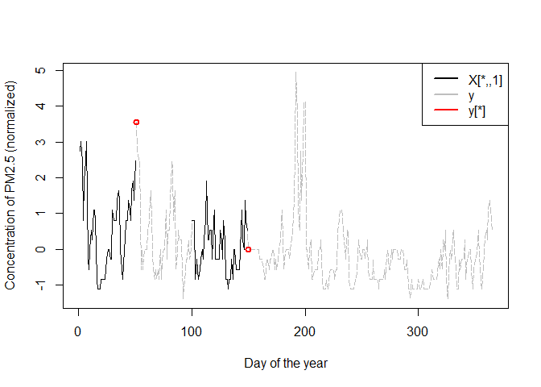
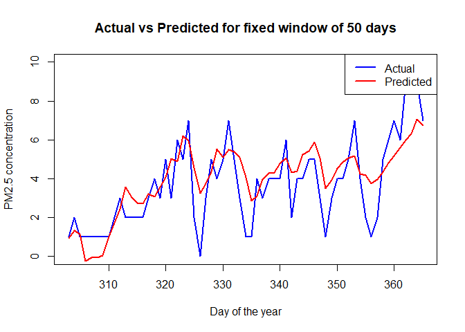

Analysis
================
Rodrigo Malagón
2024-08-29

# Pollution concentration modelling in Castellón de la Plana for 2023 using LSTM

This project aims to adapt the LSTM framework to the modellinf of
pollutants in the city of Castellón de la Plana, which

``` r
#install.packages("keras3")
library(keras3) 
```

## Data Inspection and Processing

Retrieve datasets

``` r
# Retrieve pollution datasets
data_path <- './data/raw_data/'
file_names <- list.files(data_path, full.names = FALSE, pattern = "MDEST*") #one file per station
```

``` r
# Retrieve sattions metadata file
stations <- read.csv(paste0(data_path,'stations.csv'))
stations
```

    ##                             name station_id      lat         lon alt
    ## 1              Castelló - Ermita   12040009 39.95763 -0.03742911  18
    ## 2                Castelló - Grau   12040010 39.98353  0.00896314   2
    ## 3                 Castelló - ITC   12040016 39.99583 -0.06486177  56
    ## 4  Castelló - Patronat d´Esports   12040015 39.98870 -0.02646873  20
    ## 5             Castelló - Penyeta   12040008 40.01288 -0.05812862  94
    ## 6             Castelló AP Gregal   12040302 39.96972  0.01361108   1
    ## 7            Castelló AP Llevant   12040303 39.96668  0.00890491   2
    ## 8            Castelló AP Mestral   12040306 39.97737  0.02505017   0
    ## 9             Castelló AP Ponent   12040304 39.96306  0.00694444   3
    ## 10        Castelló AP Tramuntana   12040301 39.97500  0.01638888   3
    ## 11             Castelló AP Xaloc   12040305 39.95025  0.00501868   1
    ## 12       Castelló CEIP La Marina   12040020 39.96945  0.00894270   2

Review length of datasets per station to have an initial idea of missing
data across stations.

``` r
station_id <- list()
len <- list()
for(file in file_names){
  df <- read.csv(paste0(data_path,file),skip = 3,sep ="\t",header=FALSE)
  station_id <- c(station_id,substr(file,6,13))
  len <- c(len,dim(df)[1]-2)
  #print(paste0('Number of rows for station with id ',station_id,': ',dim(df)[1]-2))
}
station_id |> unlist() -> station_id
len |> unlist() -> len
df <- data.frame('station_id' = station_id,'number_of_days' = len)
df <- merge(df,stations,by = 'station_id')
df
```

    ##    station_id number_of_days                          name      lat         lon
    ## 1    12040008            365            Castelló - Penyeta 40.01288 -0.05812862
    ## 2    12040009            362             Castelló - Ermita 39.95763 -0.03742911
    ## 3    12040010            365               Castelló - Grau 39.98353  0.00896314
    ## 4    12040015            364 Castelló - Patronat d´Esports 39.98870 -0.02646873
    ## 5    12040016            337                Castelló - ITC 39.99583 -0.06486177
    ## 6    12040020            364       Castelló CEIP La Marina 39.96945  0.00894270
    ## 7    12040301            365        Castelló AP Tramuntana 39.97500  0.01638888
    ## 8    12040302            357            Castelló AP Gregal 39.96972  0.01361108
    ## 9    12040303            362           Castelló AP Llevant 39.96668  0.00890491
    ## 10   12040304            353            Castelló AP Ponent 39.96306  0.00694444
    ## 11   12040305            357             Castelló AP Xaloc 39.95025  0.00501868
    ## 12   12040306            275           Castelló AP Mestral 39.97737  0.02505017
    ##    alt
    ## 1   94
    ## 2   18
    ## 3    2
    ## 4   20
    ## 5   56
    ## 6    2
    ## 7    3
    ## 8    1
    ## 9    2
    ## 10   3
    ## 11   1
    ## 12   0

Create list with all pollution dataframes per station

``` r
pollution_data <- list()
for(file in file_names){
  id <- substr(file,6,13)
  df <- read.csv(paste0(data_path,file),skip = 3,sep ="\t",header=FALSE)
  colnames(df)<-df[1,]
  df <- df[3:dim(df)[1],]
  df$station_id <- id
  pollution_data[[id]] <- df
}
```

Detecting pollutant with greater representation across stations

``` r
pollutants <- c('PM10','PM2.5','NOx','NO2','SO2')
num_stations <- list()
for(pol in pollutants){
  num <- lapply(pollution_data, function(x){pol %in%  colnames(x)}) |> unlist() |> sum()  
  num_stations <- c(num_stations,num)
}
num_stations|> unlist()-> num_stations
data.frame(pollutants,num_stations)
```

    ##   pollutants num_stations
    ## 1       PM10           10
    ## 2      PM2.5           11
    ## 3        NOx            5
    ## 4        NO2            5
    ## 5        SO2            4

Selecting a station dataset to work individually and inspect missing
values

``` r
id <- '12040010'
pol <- pollution_data[[id]]

change_type <- function(series){
  r <- series
  lapply(r,function(x){
      gsub(x,pattern = ',',replacement = '.')
    }) |> unlist() |> as.numeric() -> r
  return(r)
}

vars <- c('PM2.5','H.Rel.','R.Sol.','Veloc.','Temp.','Direc.')
for(var in vars){
  change_type(pol[[var]]) -> pol[[var]]
}

head(pol[vars])
```

    ##   PM2.5 H.Rel. R.Sol. Veloc. Temp. Direc.
    ## 3    15     92     85    0.5  10.6    349
    ## 4    16     91     58    0.2  11.8    216
    ## 5    14     87     85    0.4  13.1    249
    ## 6     8     86    108    0.3  11.2    178
    ## 7    12     85    107    0.4  10.5    186
    ## 8    14     89    107    0.3   9.7    316

Filling missing values

``` r
plot(1:365,pol$PM2.5,
     type = 'l',
     col = 'blue',
     main = 'Series with gaps',
     ylab = 'PM 2.5 concentration'
     )
```

<!-- -->

``` r
# Function to replace missing values with mean of remaining values
mean_replace <- function(arg){#requires a numeric vector as argument
  vec <- arg
  
  # Compute mean value for the present values
  vec[!is.na(vec)]|> mean() |> round(2) -> m
  
  # Do replacement
  replacement_counter <- 0
  replaced_values <- rep(NA,length(vec)) # vector catching just replaced values
  for(i in 1:length(vec)){
    if(is.na(vec[[i]])){
      replacement_counter <- replacement_counter + 1
      vec[[i]] <- m
      replaced_values[[i]] <- m
    }
  }
  print(paste0('Percentage of missing values replaced with mean values for series: ',round(replacement_counter/length(vec),2),'%'))
  return(list(new_series = vec,replaced_series = replaced_values))
}

apply_replacement_to_df <- function(df,col_names_vector){
  new_df <- df
  replacement_df <- df[col_names_vector]
  for(name in col_names_vector){
    ret <- mean_replace(new_df[[name]])
    new_df[[name]] <- ret$new_series
    replacement_df [[name]] <- ret$replaced_series
  }
  return(list(completed_df=new_df,replacement_df=replacement_df))
}
```

Applicaiton of missing values filling

``` r
pol_complete <- apply_replacement_to_df(pol,vars)
```

    ## [1] "Percentage of missing values replaced with mean values for series: 0.05%"
    ## [1] "Percentage of missing values replaced with mean values for series: 0.01%"
    ## [1] "Percentage of missing values replaced with mean values for series: 0.08%"
    ## [1] "Percentage of missing values replaced with mean values for series: 0.04%"
    ## [1] "Percentage of missing values replaced with mean values for series: 0.02%"
    ## [1] "Percentage of missing values replaced with mean values for series: 0.01%"

``` r
pol_complete$completed_df |> head()
```

    ##        FECHA PM2.5 Veloc. Direc. Temp. H.Rel. R.Sol. Precip. SO2 NO NO2 PM10
    ## 3 01/01/2023    15    0.5    349  10.6     92     85       0   4  4   3   15
    ## 4 02/01/2023    16    0.2    216  11.8     91     58       0   5 11   5   17
    ## 5 03/01/2023    14    0.4    249  13.1     87     85       0   5 10   5   16
    ## 6 04/01/2023     8    0.3    178  11.2     86    108       0   5  8   4   10
    ## 7 05/01/2023    12    0.4    186  10.5     85    107     0,2   5          14
    ## 8 06/01/2023    14    0.3    316   9.7     89    107       0   4          15
    ##   NOx O3 station_id
    ## 3   9 13   12040010
    ## 4  22  9   12040010
    ## 5  20 11   12040010
    ## 6  16 12   12040010
    ## 7     12   12040010
    ## 8     15   12040010

``` r
pol <- pol_complete$completed_df
```

Plot time series with replaced values

``` r
plot(1:365,pol$PM2.5,
     type = 'l',
     col = 'blue'
     )
lines(1:365,pol_complete$replacement_df$PM2.5,
       col = 'red',
       lwd = 2)

# Legend
legend("topright", legend = c('completed series','replaced values'), col = c('blue','red'), lty = 1, lwd = 2)
```

<!-- -->

Preparing dataset for LSTM

``` r
# Data selection
cols_selected <- vars
data <- pol[cols_selected] |> data.matrix() |> unname()
ndata <- dim(data)[2]
len_series <- dim(data)[1]
```

Dataset normalization

``` r
norm_series <- function(series){
  m <- min(series)
  d <- max(series)-m
  return((series-m)/d)
}


for(col in 1:ndata){
  data[,col] <- norm_series(data[,col])
}

t_series <- data[,1]
```

Creation of LSTM-ready datasets

``` r
lag <- 50#round(dim(pol)[1]/2)

# Apply lag to dataset to obtain array of input sequences
X <- array(NA, dim = c((len_series - lag), lag, ndata))
len <- dim(X)[1]
y <- array(NA, dim = c(len, 1))

for(i in 1:len){
  lag_selection_1 <- i:(lag+i-1)
  X[i,,1] <- t_series[lag_selection_1]
  if(ndata > 1){
    lag_selection_2 <- lag_selection_1 + 1
    X[i,,2:ndata] <- data[lag_selection_2,2:ndata]
  }
  y[i,]<- t_series[i+lag]
}


# Split into training and test sets
train_size <- round(len * 0.8)
X_train <- X[1:train_size,,]
y_train <- y[1:train_size,]

X_test <- X[(train_size + 1):len,,]
y_test <- y[(train_size + 1):len,]
```

A little of visualization of our datasets

``` r
plot((1+lag):(len+lag),y,
      col = 'grey',
        type='l',
      lty=5,
        xlab = 'Day of the year',
        ylab = 'Concentration of PM2.5 (normalized)',
        xlim = c(1,365),
      lwd =1
     )
for(id in c(1, 100)){
  lines(id:(lag+id-1),t_series[id:(lag+id-1)],
      col = 'black',lwd = 1)
points((id+lag),y[id],
       col = 'red',
       lwd = 2)
}


# Legend
legend("topright", legend = c("X[*,,1]",'y','y[*]'), col = c("black", "gray",'red'), lty = 1, lwd = 2)
```

<!-- -->

\#Data modelling

``` r
model <- 0
model <- keras_model_sequential() %>%
  layer_lstm(units = lag, activation = 'relu', input_shape = c(lag, ndata)) %>%
  layer_dense(units = 1)

#Set parameters
model %>% compile(
  loss = 'mean_squared_error',
  optimizer = optimizer_adam(learning_rate = 1e-4),
  metrics = c('mae')
)


summary(model)
```

    ## Model: "sequential"
    ## ┌───────────────────────────────────┬──────────────────────────┬───────────────
    ## │ Layer (type)                      │ Output Shape             │       Param # 
    ## ├───────────────────────────────────┼──────────────────────────┼───────────────
    ## │ lstm (LSTM)                       │ (None, 50)               │        11,400 
    ## ├───────────────────────────────────┼──────────────────────────┼───────────────
    ## │ dense (Dense)                     │ (None, 1)                │            51 
    ## └───────────────────────────────────┴──────────────────────────┴───────────────
    ##  Total params: 11,451 (44.73 KB)
    ##  Trainable params: 11,451 (44.73 KB)
    ##  Non-trainable params: 0 (0.00 B)

## Train model

``` r
history <- model %>% fit(
  x = X_train, 
  y = y_train,
  epochs = 10,
  batch_size = 1,
  validation_data = list(X_test, y_test),
  verbose = 2
)
```

    ## Epoch 1/10
    ## 252/252 - 5s - 20ms/step - loss: 0.0394 - mae: 0.1392 - val_loss: 0.0199 - val_mae: 0.1176
    ## Epoch 2/10
    ## 252/252 - 3s - 11ms/step - loss: 0.0270 - mae: 0.1163 - val_loss: 0.0120 - val_mae: 0.0894
    ## Epoch 3/10
    ## 252/252 - 3s - 11ms/step - loss: 0.0230 - mae: 0.1049 - val_loss: 0.0085 - val_mae: 0.0752
    ## Epoch 4/10
    ## 252/252 - 3s - 10ms/step - loss: 0.0197 - mae: 0.0980 - val_loss: 0.0059 - val_mae: 0.0599
    ## Epoch 5/10
    ## 252/252 - 3s - 11ms/step - loss: 0.0172 - mae: 0.0925 - val_loss: 0.0050 - val_mae: 0.0530
    ## Epoch 6/10
    ## 252/252 - 3s - 12ms/step - loss: 0.0162 - mae: 0.0862 - val_loss: 0.0044 - val_mae: 0.0500
    ## Epoch 7/10
    ## 252/252 - 3s - 10ms/step - loss: 0.0147 - mae: 0.0836 - val_loss: 0.0040 - val_mae: 0.0504
    ## Epoch 8/10
    ## 252/252 - 3s - 11ms/step - loss: 0.0147 - mae: 0.0826 - val_loss: 0.0048 - val_mae: 0.0548
    ## Epoch 9/10
    ## 252/252 - 3s - 11ms/step - loss: 0.0137 - mae: 0.0809 - val_loss: 0.0056 - val_mae: 0.0619
    ## Epoch 10/10
    ## 252/252 - 3s - 11ms/step - loss: 0.0137 - mae: 0.0805 - val_loss: 0.0041 - val_mae: 0.0512

## Predict and bumb-up

``` r
predictions <- model %>% predict(X_test)
```

    ## 2/2 - 0s - 203ms/step

``` r
bump_up <- function(series,ref_series){
  s <- min(ref_series)
  d <- max(ref_series)-s
  return(series*d + s)
}

# Plot the results

title = paste0("Actual vs Predicted for fixed window of ",lag,' days')

plot((train_size + lag + 1):365, bump_up(y_test,pol$PM2.5), type = 'l', col = 'blue', lwd = 2,
     main = title, xlab = "Day of the year", ylab = "PM2.5 concentration")
lines((train_size + lag + 1):365, bump_up(predictions,pol$PM2.5), col = 'red', lwd = 2)


legend("topright", legend = c("Actual", "Predicted"), col = c("blue", "red"), lty = 1, lwd = 2)
```

<!-- -->
